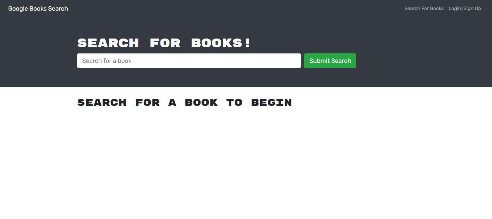

# Google Book Search (Refactored to use GraphQL and Apollo)

## Table of Contents

-   [Description](#description)
-   [Installation](#installation)
-   [Usage](#usage)
-   [Contributing](#contributing)

## Description

Refactored Google book search with book saving functionality.

## Installation

-   `git clone` this repository locally.
-   Run `npm i` to install all dependencies.

## Usage

-   Run `npm run develop` to run the development version locally
-   Alternatively, you can visit the Heroku Deployment [here](https://book-search-refactor.herokuapp.com/)
-   Create an account
-   Search and save books you want to read

## Link

[GitHub](https://github.com/CyanideTheJuggla/book-search-refactor)

[Heroku](https://book-search-refactor.herokuapp.com/)

## Contributing

Made by [Scott Howell](https://github.com/cyanidethejuggla)
